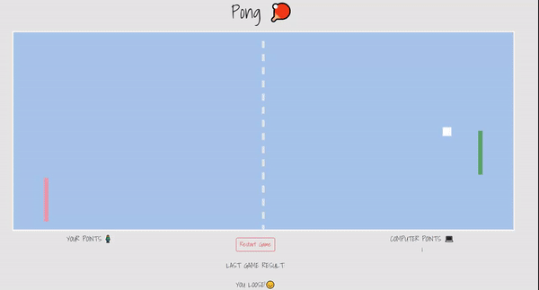

# Tenis

> Tenis is a game made for old pong game fans 🏓

## Table of contents

- [Technologies](#technologies)
- [Setup](#setup)
- [Features](#features)
- [Inspiration](#inspiration)

## Technologies

- JavaScript ES6
- Canvas

## Setup

To run this project install it locally and open index.html live server using for example Visual Studio Code or Atom.

You can also play it here: http://justynagawlik.pl/

## Features

- Move your paddle using computer mouse 🖱️
- Collect your points and defeat computer 
- Play on your computer 📵

## Inspiration

This app is inspired by Samuraj Programowania (https://www.youtube.com/watch?v=8IJ_1QcqMdM&list=PLTs20Q-BTEMMSpaBeLpGECE3748o2MOFD)
